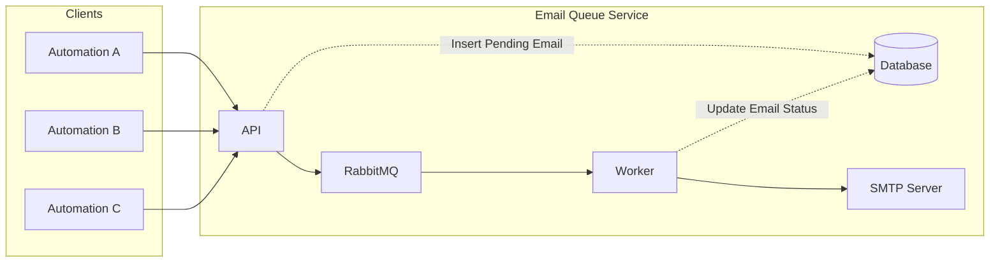

# Email Queue Service

[](https://github.com/marksxiety/email-queue-service/releases)
[](https://opensource.org/licenses/MIT)
[](https://www.rabbitmq.com/)
[](https://www.python.org/)

A robust, centralized email delivery microservice that decouples email operations from your applications. Built with FastAPI and RabbitMQ, it provides reliable, priority-based email queuing with template support and attachment handling.

---

## Why Use This Service?

**Before:** Each automation system manages its own email logic, SMTP connections, and retry mechanisms.

**After:** One centralized service handles all email operations with:
- **Reliability** - RabbitMQ ensures no messages are lost
- **Priority Management** - Critical emails get delivered first
- **Template Consistency** - Centralized email templates
- **Status Tracking** - Monitor email delivery in real-time
- **Simplified Integration** - Single API endpoint for all systems

---

## Architecture Overview



**How it works:**
1. Applications send email requests to the API
2. API validates and stores the request in the database
3. Message is published to the appropriate RabbitMQ queue based on priority
4. Workers consume messages and send emails via SMTP
5. Database is updated with delivery status

---

## Key Features

### Core Functionality
- **Priority-Based Queues** - Three-tier priority system (high, normal, low)
- **Dynamic Recipients** - Override default recipients on a per-request basis
- **File Attachments** - Support for multiple file types (PDF, DOCX, images, etc.)
- **Template Engine** - Jinja2-powered email templates with dynamic data
- **Status Tracking** - Real-time monitoring of email delivery status
- **Reliable Delivery** - RabbitMQ-backed message persistence

### Technical Features
- RESTful API built with FastAPI
- PostgreSQL database for email tracking
- Multipart form-data support for file uploads
- Configurable SMTP server integration
- Environment-based configuration

---

## Quick Start

### Prerequisites

Ensure you have the following installed:
- **Python** 3.8 or higher
- **RabbitMQ** 3.8 or higher
- **PostgreSQL** database
- **SMTP Server** (Gmail, SendGrid, etc.)

### Installation

**1. Clone the repository**
```bash
git clone https://github.com/marksxiety/email-queue-service.git
cd email-queue-service
```

**2. Install dependencies**
```bash
pip install -r requirements.txt
```

**3. Configure environment variables**
```bash
cp .env.example .env
```

Edit `.env` with your configuration:

```env
# API Configuration
API_HOST=0.0.0.0
API_PORT=8000

# RabbitMQ Configuration
RABBITMQ_HOST=localhost
RABBITMQ_PORT=5672
RABBITMQ_USER=guest
RABBITMQ_PASS=guest

# SMTP Configuration
SMTP_HOST=smtp.gmail.com
SMTP_PORT=587
SMTP_USER=your-email@gmail.com
SMTP_PASS=your-app-password

# Database Configuration
DB_HOST=localhost
DB_PORT=5432
DB_NAME=email_queue
DB_USER=postgres
DB_PASS=your-password

# Upload Configuration
UPLOAD_DIR=./uploads
```

**4. Initialize the database**

See **[DATABASE.md](./app/database/DATABASE.md)** for migration instructions.

### Running the Service

**Start the API server:**
```bash
python -m app.api_server
```

The API will be available at `http://localhost:8000`

**Start the worker (in a separate terminal):**
```bash
python -m app.worker
```

The worker will begin consuming messages from RabbitMQ queues.

---

## API Usage

For detailed API documentation, request examples, and integration guides, see **[USAGE.md](./USAGE.md)**.

---

## Documentation

**[API Documentation](./USAGE.md)** - Comprehensive API usage guide with examples

---

## License

This project is licensed under the MIT License - see the [LICENSE](./LICENSE) file for details.