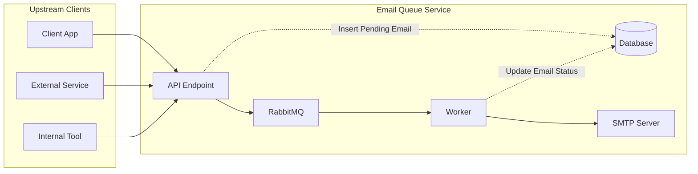

# Email Queue Service

A robust, centralized email delivery microservice that decouples email operations from your applications. Built with FastAPI and RabbitMQ, it provides reliable, priority-based email queuing with template support and attachment handling.

---

## Why Use This Service?

**Before:** Each automation system manages its own email logic, SMTP connections, and retry mechanisms.

**After:** One centralized service handles all email operations with:
- **Reliability** - RabbitMQ ensures no messages are lost
- **Priority Management** - Critical emails get delivered first
- **Template Consistency** - Centralized email templates
- **Status Tracking** - Monitor email delivery in real-time
- **Simplified Integration** - Single API endpoint for all systems

---

## Architecture

**How it works:**
1. Applications send email requests to the API
2. API validates and stores the request in the database
3. Message is published to the appropriate RabbitMQ queue based on priority
4. Workers consume messages and send emails via SMTP
5. Database is updated with delivery status

---

## Key Features

### Core Functionality
- **Priority-Based Queues** - Three-tier priority system (high, normal, low)
- **Rate Limiting** - Per-IP rate limiting with configurable thresholds and grace period
- **Dynamic Recipients** - Override default recipients on a per-request basis
- **File Attachments** - Support for multiple file types with security validation
- **Template Engine** - Jinja2-powered email templates with dynamic data
- **Status Tracking** - Real-time monitoring of email delivery status
- **Reliable Delivery** - RabbitMQ-backed message persistence

### Technical Features
- RESTful API built with FastAPI
- PostgreSQL database for email tracking
- Multipart form-data support for file uploads
- Configurable SMTP server integration
- Environment-based configuration
- Path traversal protection for file uploads
- Magic byte verification for file type detection

---

## File Attachment Limitations

The service enforces strict security measures for file attachments:

### Allowed File Types

| Category | Extensions | MIME Types |
|----------|------------|------------|
| **Documents** | `.pdf`, `.doc`, `.docx`, `.xls`, `.xlsx` | `application/pdf`, `application/msword`, `application/vnd.openxmlformats-officedocument.wordprocessingml.document`, `application/vnd.ms-excel`, `application/vnd.openxmlformats-officedocument.spreadsheetml.sheet` |
| **Text** | `.txt` | `text/plain` |
| **Archives** | `.zip` | `application/zip` |
| **Images** | `.jpg`, `.jpeg`, `.png`, `.gif`, `.bmp`, `.webp`, `.tiff` | `image/jpeg`, `image/png`, `image/gif`, `image/bmp`, `image/webp`, `image/tiff` |

### Security Measures
1. **Magic Byte Verification** - File type is detected from actual content, not client-provided headers
2. **Path Traversal Protection** - Filenames are sanitized to prevent directory traversal attacks
3. **Extension Whitelist** - Only allowed extensions are accepted
4. **File Size Limit** - Default maximum of 10MB per file (configurable via `MAX_FILE_SIZE`)
5. **MIME Type Validation** - Double validation against both client-provided and detected MIME types

---

## Documentation

**[SETUP.md](./SETUP.md)** - Installation and setup guide

**[USAGE.md](./USAGE.md)** - Complete API documentation with examples

**[DATABASE.md](./app/database/DATABASE.md)** - Database schema and migrations

**[TEST.md](./tests/TEST.md)** - Testing guide and test coverage

---

## License

[MIT](./LICENSE)
