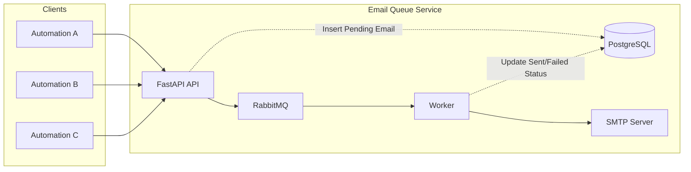

# Email Queue Service

A centralized email delivery microservice designed to decouple email-sending from automation systems. Routes all email requests through a single service that handles queuing, reliability, and delivery via SMTP.

## Architecture



## Features

- **Centralized API** - Single endpoint for all email requests
- **Priority Queues** - High, normal, and low priority email queues
- **Reliability** - RabbitMQ ensures no lost messages

## Prerequisites

- Python 3.8+
- RabbitMQ 3.8+
- SMTP Server

## Setup

### 1. Clone and Install Dependencies

```bash
git clone https://github.com/marksxiety/email-queue-service.git
cd email-queue-service
pip install -r requirements.txt
```

### 2. Configure Environment Variables

Copy `.env.example` to `.env` and update with your settings:

```bash
cp .env.example .env
```

Key configuration sections:
- **API**: Host and port settings
- **RabbitMQ**: Connection credentials and queue names
- **SMTP**: Mail server details

### 3. Start Services

**Start the FastAPI service:**

```bash
python app/main.py
```

**Start the worker:**

```bash
python app/workers/worker.py
```

## Usage

### Queue Email Request

**Endpoint:** `POST /api/v1/emails/queue`

**Request Body:**

```json
{
  "sender": "system_automation",
  "email_type": "welcome",
  "subject": "Welcome to Our Platform",
  "email_template": "default_template",
  "email_data": {
    "name": "John Doe",
    "company": "Acme Corp"
  },
  "priority_level": 1
}
```

**Response:**

```json
{
  "message": "Payload received successfully",
  "data": { ... },
  "email_id": "550e8400-e29b-41d4-a716-446655440000"
}
```

### Priority Levels

- **1**: High priority queue (`email.high`)
- **2**: Normal priority queue (`email.normal`)
- **3-10**: Low priority queue (`email.low`)

## Message Flow

1. Client submits email request via HTTP
2. API validates request
3. Message published to RabbitMQ based on priority
4. Worker consumes from queues (high → normal → low)
5. Email sent via SMTP

## License

MIT
